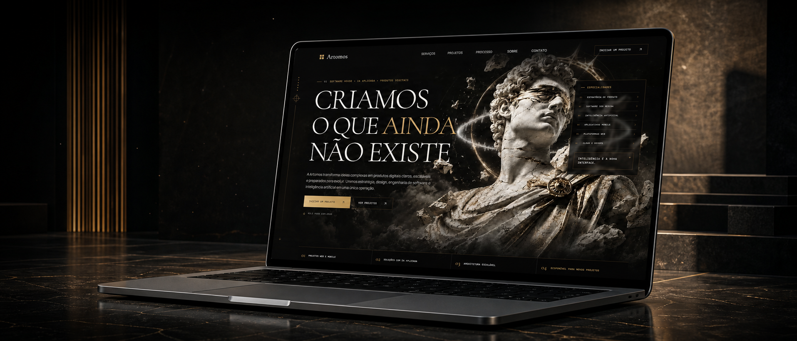

<p align="center">
  
</p>

<h1 align="center">Artomos</h1>

<p align="center">
  <strong>Arte, estratégia e engenharia transformadas em experiências digitais.</strong><br />
  Site institucional da Artomos — um estúdio digital brasileiro que cria sites premium animados, software sob medida e produtos com inteligência artificial.
</p>

<p align="center">
  <a href="https://artomos.com">Ver experiência online</a>
  ·
  <a href="mailto:contato@artomos.com">Iniciar um projeto</a>
</p>

## Sobre o projeto

Este repositório contém a experiência institucional da Artomos. O site foi concebido como uma peça digital editorial: tipografia expressiva, direção de arte inspirada em escultura clássica, detalhes técnicos e animações que conectam cada seção em uma narrativa contínua.

Mais do que apresentar serviços, o projeto demonstra a abordagem que levamos aos produtos dos nossos clientes: identidade forte, interação com propósito, implementação cuidadosa e performance pronta para produção.

## O que construímos

- Sites premium e landing pages com direção de arte própria
- Experiências animadas e narrativas guiadas por scroll
- Plataformas web e aplicativos mobile
- Software sob medida e arquitetura escalável
- Automações e integrações de processos
- Produtos e interfaces com inteligência artificial aplicada

## Experiência e movimento

A abertura combina uma composição cinematográfica com uma sequência de frames AVIF sincronizada ao scroll. GSAP e ScrollTrigger coordenam as transições; Lenis fornece rolagem suave; e a experiência respeita `prefers-reduced-motion`, mantendo o conteúdo acessível para quem prefere menos movimento.

Os assets, fontes e efeitos são servidos localmente. Isso evita dependências visuais externas, preserva a identidade da marca e oferece controle fino sobre carregamento e renderização.

## Stack

| Camada | Tecnologia |
| --- | --- |
| Interface | React 19 + TypeScript |
| App Router | Next.js 16 via Vinext |
| Animação | GSAP, ScrollTrigger e Lenis |
| Estilo | Tailwind CSS 4 + CSS global autoral |
| Build | Vite 8 + Vinext |
| Runtime | Node.js 22 |
| Deploy | Docker ou Cloudflare Workers |
| Qualidade | ESLint + testes do HTML renderizado |

## SEO e identidade

O projeto publica metadata social, canonical absoluto, dados estruturados Schema.org, `robots.txt`, `sitemap.xml` e web manifest. Todos os sinais usam `https://artomos.com` como endereço canônico e reforçam **Artomos** como nome oficial da marca.

Após cada deploy relevante, recomendamos validar a URL e enviar o sitemap no Google Search Console:

```text
https://artomos.com/sitemap.xml
```

## Rodando localmente

Requisitos: Node.js `22.x` LTS (`>=22.13.0 <24`) e npm.

```bash
npm install
npm run dev
```

Acesse `http://localhost:3000`.

## Qualidade e build

```bash
npm run lint
npm test
```

`npm test` gera o build de produção e valida o HTML renderizado. Para executar o build isoladamente:

```bash
npm run build
```

O projeto também inclui um `Dockerfile` multi-stage pronto para produção:

```bash
docker build -t artomos-site .
docker run --rm -p 3000:3000 artomos-site
```

## Estrutura

```text
app/                    Rotas, metadata e composição da landing page
src/components/         Seções, layout e componentes visuais
src/config/site.ts      Conteúdo institucional e configuração da marca
src/data/               Serviços, projetos e etapas do processo
src/lib/                Utilitários de animação e helpers
public/assets/artomos/  Arte, imagens e frames das transições
public/fonts/           Fontes locais
tests/                  Validações do HTML de produção
worker/                 Entrada para Cloudflare Workers
```

---

<p align="center">
  <strong>Artomos</strong> — criamos o que ainda não existe.<br />
  <a href="https://artomos.com">artomos.com</a>
</p>
